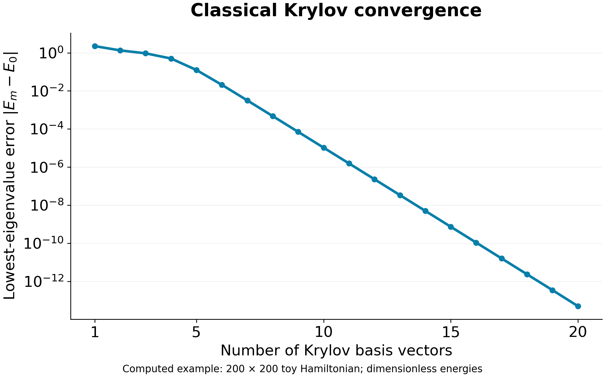

# Classical Krylov convergence: learning example

A short learning example illustrating classical Krylov subspace convergence.


Inspired by IBM Quantum Learning, **Krylov quantum diagonalization**, Sections 1.1 and 2.1:
https://quantum.cloud.ibm.com/learning/en/courses/quantum-diagonalization-algorithms/krylov
Accessed 8 October 2026.

## Run

```bash
python3 -m venv .venv
.venv/bin/python -m pip install numpy matplotlib
.venv/bin/python krylov_demo.py
```

Only NumPy and Matplotlib are required. No quantum hardware is used.

## What is computed

The routine builds an orthonormal basis for span{v, Hv, H²v, ...} by applying H and removing projections onto previous vectors twice. At each dimension m it diagonalizes QᵀHQ and computes the absolute difference from the exact lowest eigenvalue. This is an uncompressed, unrestarted classical Krylov demonstration, not a CK or CKCI benchmark.

Validation first reproduces IBM's worked 3×3 example with diagonal entries 4 and nearest off-diagonal entries -1, starting from (1,0,0). The Ritz estimates are 4, 3, and 4−√2.

The plotted example uses a 200×200 diagonal test matrix: one eigenvalue 0.25 and 199 eigenvalues equally spaced from 1 to 4. The starting vector has equal components, normalized to unit length. This creates a separated lowest eigenvalue and a known nonzero initial overlap; the resulting curve is computed, not prescribed as an exponential. No randomness, compression, molecular Hamiltonian or noise is involved. Energies are dimensionless. Orthogonality, the variational bound and monotonic convergence are checked.

The PNG and PDF show the same 20 computed checkpoints; the CSV supplies exact numeric values. This example illustrates convergence for a chosen gapped spectrum. It is not a proof of universal exponential convergence or of CK performance. The spectrum, gap, starting-state overlap and numerical precision affect convergence.

## Figure description

“Classical Krylov convergence for a 200×200 toy Hamiltonian. The error in the lowest Ritz eigenvalue is measured relative to exact diagonalization. Independently computed example inspired by IBM Quantum Learning, ‘Krylov quantum diagonalization.’”

## Citation and reproducibility

Repository: https://github.com/sonaljainsonaljain/krylov-convergence-demo.

Cite IBM Quantum Learning for the teaching source and this repository for the code and computed example. This is an independent implementation, not an exact reproduction of IBM's larger plotted example. Only the worked 3×3 validation uses IBM's specific matrix. The 200×200 test matrix and plot were created here. No quantum processor or chemistry calculation was used.

Suggested figure credit: “Classical Krylov learning example, inspired by IBM Quantum Learning.”

For the theoretical convergence claim, also cite Kirby, Motta and Mezzacapo, “Exact and efficient Lanczos method on a quantum computer,” Quantum 7, 1018 (2023), https://doi.org/10.22331/q-2023-05-23-1018 . This numerical example alone does not establish the theorem.

For immutable reproducibility, use the specific commit permalink rather than only the moving main branch. A GitHub repository link is not a DOI; a release can be archived separately if a DOI is needed later.
